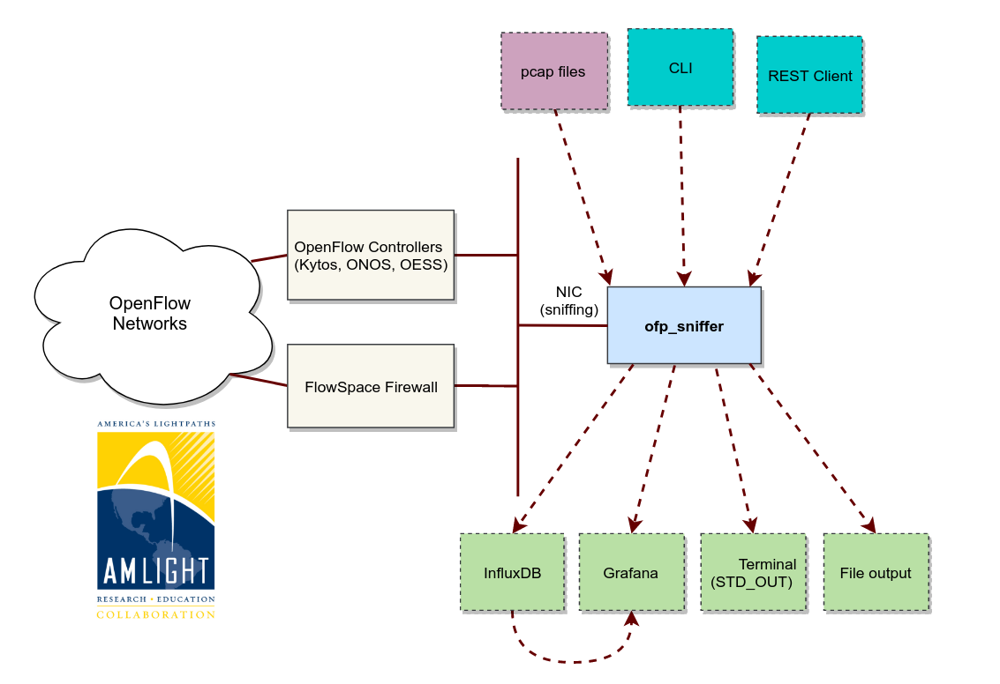

Introduction
============

`ofp_sniffer` is an OpenFlow sniffer to be used for troubleshooting and learning purposes.

It works directly on Linux shell and dissects all OpenFlow messages on the wire or from libpcap files. Using OFP_Sniffer, you can easily track OpenFlow messages and errors associated (if any) without opening X11 or Wireshark. OFP_Sniffer was written in Python 3.6 to support the AmLight SDN deployment (www.sdn.amlight.net).  AmLight SDN uses Internet2 FlowSpace Firewall, OESS and On.Lab ONOS, and these apps were tested and are fully supported.

Versions
--------

- 1.1 is the current version, which dissects all OpenFlow 1.0 messages.
- 1.0 was the first major release that started supporting specific needs, such as track OESS FVD messages and REST API to enable integration with other systems (NMSes, such as Zabbix).

.. note::

    Version 1.2 will support OpenFlow version 1.3. This version is planned to be release soon.

Features
--------

In summary, `ofp_sniffer` supports these major features:

- Dissects OpenFlow messages with no X11 dependencies on either network interfaces or pcap files.
- Filter specific OpenFlow messages, e.g., OFPT_PACKET_IN, OFPT_PACKET_OUT, and so on.
- Support for OpenFlow proxies (e.g. FlowSpace Firewall, Flowvisor). `ofp_sniffer` automatically monitors all PacketOut and LLDP messages to create a dictionary of (IP, port) and switch names, which improves the readability of the logs to understand from which switch or proxy the OpenFlow message came from.
- Statistics of OpenFlow messages, which allows you to find out the number of specific messages per dpid and other crucial information for production networks.
- Batteries included with InfluxDB and Grafana for Web-based dashboards.
- Import OpenFlow topology based on json format, which enables better corellation for dissecting messages and static topology (production networks).

Design
------

A general idea of how `ofp_sniffer` was designed to integrate with OpenFlow networks and other systems and interfaces is illustrated below:

